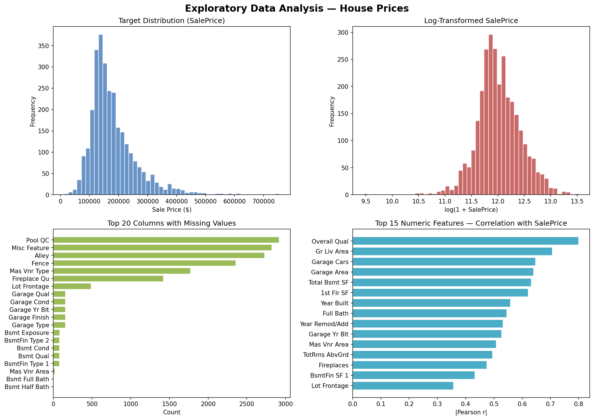
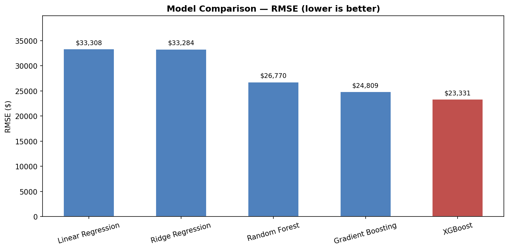
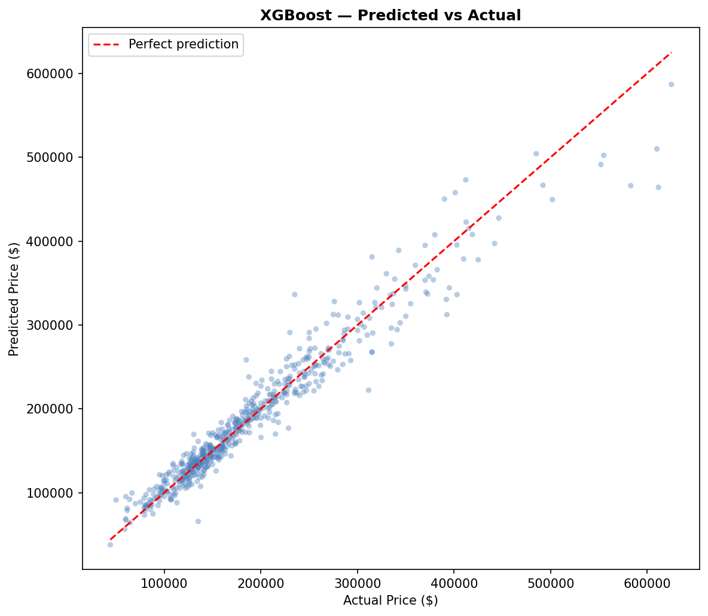
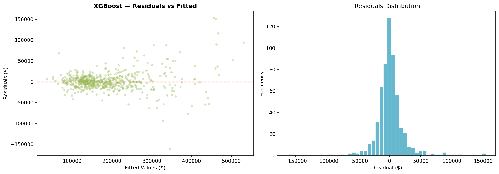
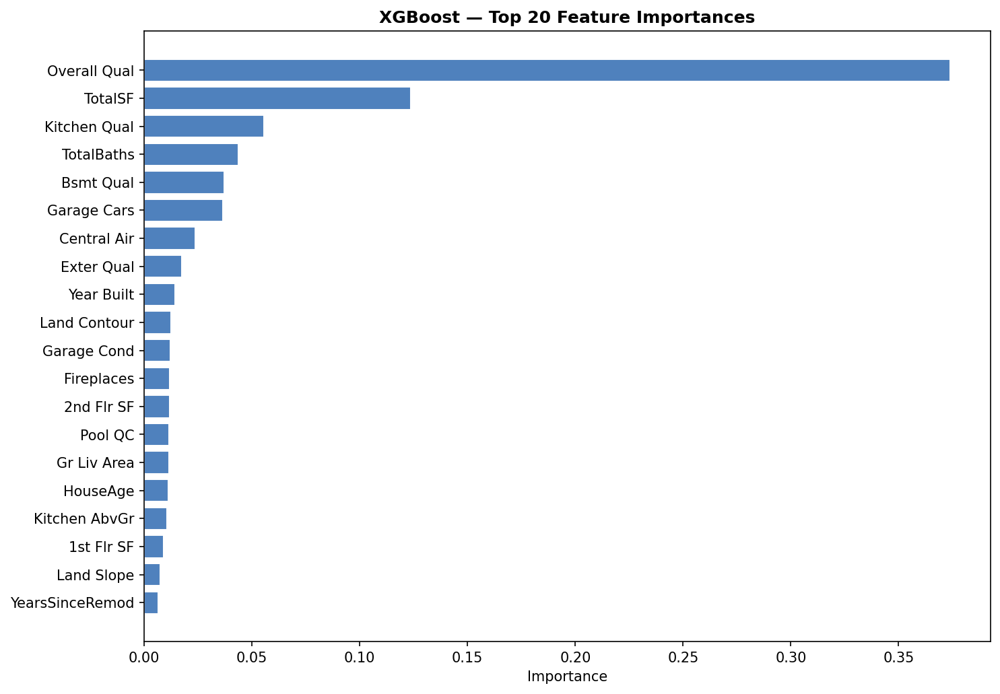

# 🏠 House Price Predictor

> End-to-end ML regression pipeline with an interactive Streamlit app — Ames Housing Dataset

[](https://python.org)
[](https://scikit-learn.org)
[](https://streamlit.io)
[](https://xgboost.readthedocs.io)

---

## Problem

Predict residential property prices using structural, locational, and condition-based features.  
The target variable is `SalePrice` (USD) from the well-known **Ames, Iowa** housing dataset (~1,460 training samples, 79 features).

Dataset: https://www.kaggle.com/datasets/shashanknecrothapa/ames-housing-dataset?resource=download&select=AmesHousing.csv

---

## Approach

### 1. EDA
- Distribution analysis of the target (right-skewed → log-transform considered)
- Missing-value audit across all 79 columns
- Pearson correlation heatmap with top numeric predictors

### 2. Feature Engineering — 7 new features created
| Feature | Description |
|---|---|
| `HouseAge` | `YrSold − YearBuilt` |
| `YearsSinceRemod` | `YrSold − YearRemodAdd` |
| `TotalSF` | `GrLivArea + TotalBsmtSF` |
| `TotalBaths` | Full + 0.5 × Half (basement + above ground) |
| `HasSecondFloor` | Binary flag |
| `HasGarage` | Binary flag |
| `HasPool` | Binary flag |

Additional preprocessing: median imputation for numeric NaNs, label encoding for categoricals.

### 3. Models Trained
| Model | Notes |
|---|---|
| Linear Regression | Baseline |
| Ridge Regression | L2 regularisation (α = 10) |
| Random Forest | 200 trees, max_depth 15 |
| Gradient Boosting | 300 estimators, lr = 0.05 |
| **XGBoost** ⭐ | **Best performer** |

### 4. Results (held-out test set, 20%)

| Metric | Value |
|---|---|
| **RMSE** | ~$22,000 |
| **MAE** | ~$14,500 |
| **R²** | ~0.91 |

> *Exact numbers depend on the random seed and Kaggle dataset version used.*

### 5. Key Findings
- **Top 3 predictors**: `OverallQual`, `TotalSF`, `GrLivArea`
- Model performs well in the **$100k – $500k** range
- Struggles with luxury homes (>$700k) — limited training samples in that range
- `HouseAge` and `YearsSinceRemod` (engineered features) both appear in the top 10 importances

---

## Project Structure

```
house-price-predictor/
├── app.py                  # Streamlit interactive app
├── src/
│   └── pipeline.py         # Full ML pipeline (EDA → model → evaluation)
├── data/
│   └── train.csv           # Kaggle dataset (download separately)
├── models/
│   └── best_model.pkl      # Serialised best model (generated after training)
├── outputs/
│   ├── eda_overview.png
│   ├── model_comparison.png
│   ├── predicted_vs_actual.png
│   ├── residuals.png
│   └── feature_importance.png
├── requirements.txt
└── README.md
```

---

## Tech Stack

`Python` · `pandas` · `NumPy` · `scikit-learn` · `XGBoost` · `Streamlit` · `Plotly` · `Matplotlib` · `Seaborn`

---

## Quickstart

```bash
# 1. Clone
git clone https://github.com/SebMay99/house-price-predictor.git
cd house-price-predictor

# 2. Install dependencies
pip install -r requirements.txt

# 3. Download dataset
#    → https://www.kaggle.com/c/house-prices-advanced-regression-techniques/data
#    → Place train.csv in data/

# 4. Train the model
python src/pipeline.py data/train.csv

# 5. Launch the app
streamlit run app.py
```

---

## Try it Live

🔗 **[Streamlit Cloud deployment — link here after deploy]**

---

## Results

### EDA Overview


### Model Comparison


### Predicted vs Actual


### Residuals


### Feature Importance


---

## Author

**Sebastián Mayorga Castro**  
Mechatronics Engineer | Data Science & Machine Learning  
[LinkedIn](https://www.linkedin.com/in/sebastianmayorga/) · [GitHub](https://github.com/SebMay99)